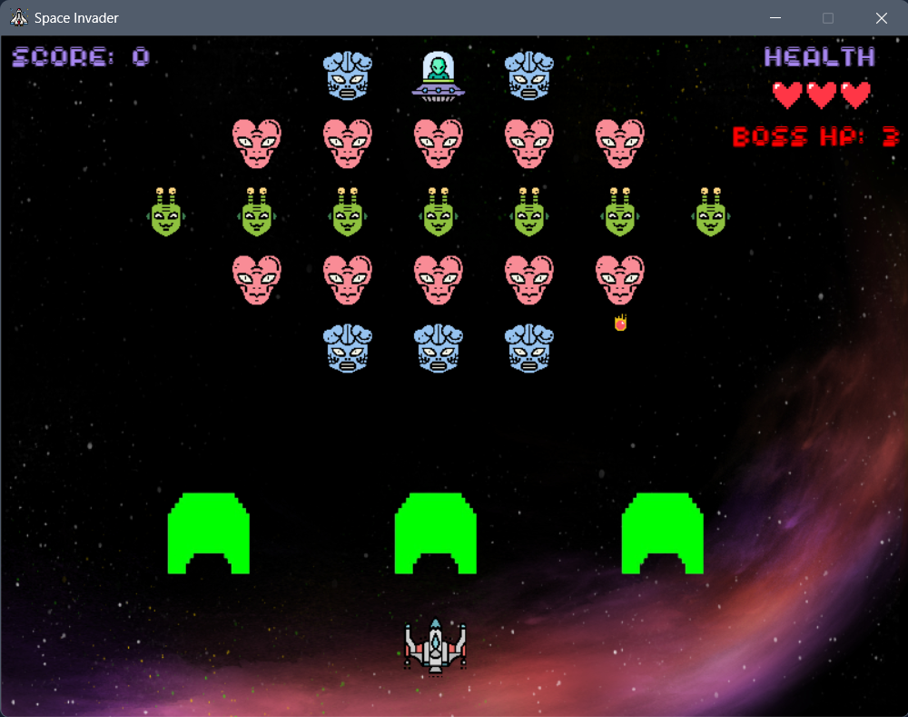
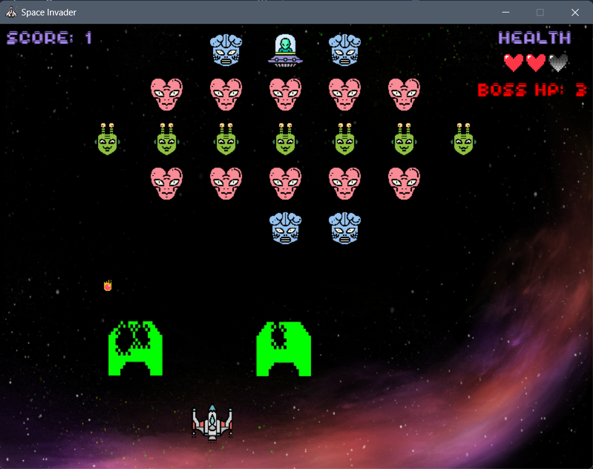
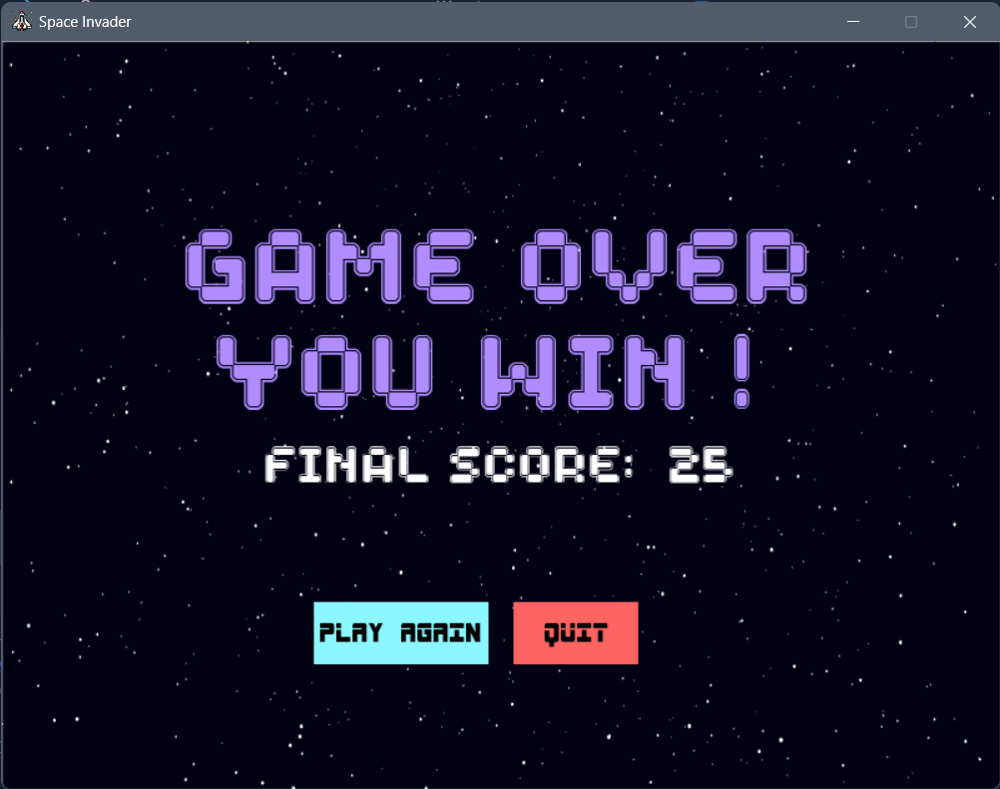

# 🚀 Space Invader - Pygame

A retro-style **Space Invader game** built using **Python and Pygame**, featuring:
- Multiple enemy types (including a boss with health)
- Bullet collision mechanics
- Health bar and score system
- Background music and sound effects
- Game Over screen with **Play Again** and **Quit** buttons

---

## 🖼️ Preview

 


---

## 🎮 Controls

- **Arrow Keys** – Move the spaceship
- **Spacebar** – Fire bullets

---

## 🛠️ Requirements

- Python 3.x
- `pygame` module

- Install using:
`pip install pygame`

---
## ▶️ How to Run

### 🔹 Step 1: Install Requirements  
Make sure Python is installed. Then install the Pygame module:

```bash
  pip install pygame
```
### 🔹 Step 2: Place All Required Files in the Same Folder
Ensure the following files are in the same directory as space_invader.py:
```
- space_invader.py

- background.jpg

- spaceBg.jpg

- spaceship.png

- spaceship (1).png

- alien1.png

- alien2.png

- alien3.png

- ufo.png

- bunker1.png

- bunker2.png

- bunker3.png

- bullet.png

- bulletEnemy.png

- aliveHeart.png

- deadHeart.png

- bgm.mp3

- laser2.wav

- explosion.wav

- explosionEnemy.mp3

- explosionWarning.mp3

- bgm.mp3

- gameWinBGM.mp3

- gameOverBGM.mp3

- laser2.wav

- explosion.wav

- spaceboy.ttf

- spacebar.ttf
```

## 🔹 Step 3: Run the Game

Open a terminal or command prompt, navigate to the folder where your game files are located, and run:

```bash
  python space_invader.py
```
---

## 💡 Features
**🎯 Bullet Collision** – Destroy enemies before they reach you.

**🧠 Boss Enemy** – Fight a UFO with higher health.

**💓 Health Bar** – Visual life tracking system.

**🔊 Sound Effects** – Laser fire, explosions, and background music.

**🎮 Game Over Menu** – Replay or quit with the click of a button.

**💾 Score System** – Track your performance each round.

---

## 👨‍💻 Author

Made with ❤️ by [Aditya Singh](https://github.com/adityas-28)**
=======
