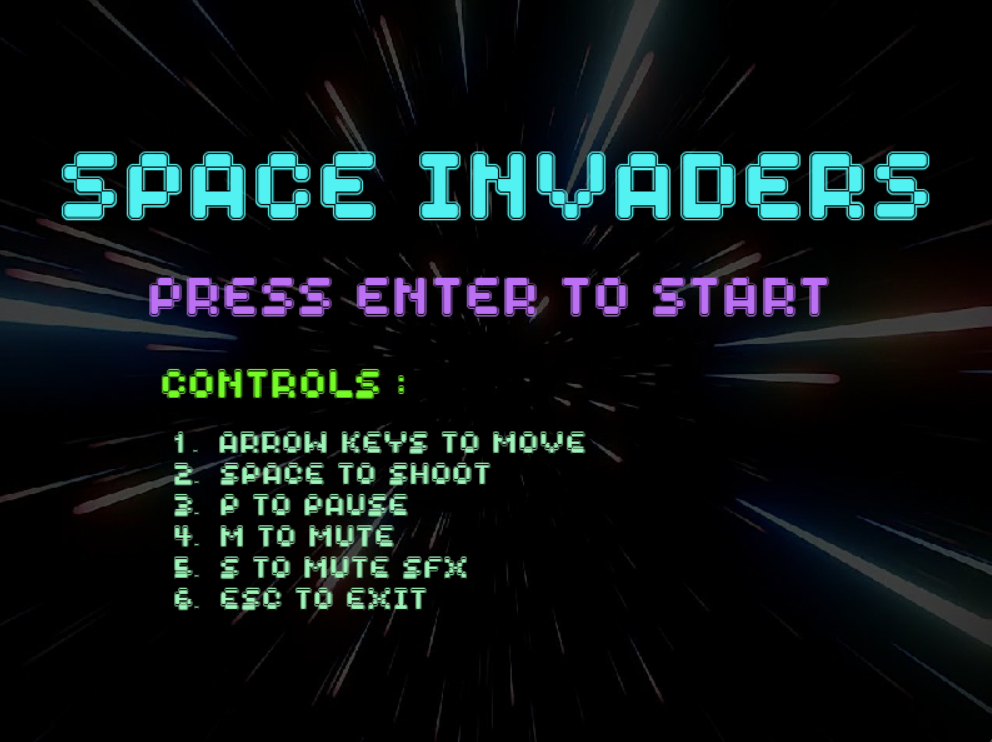
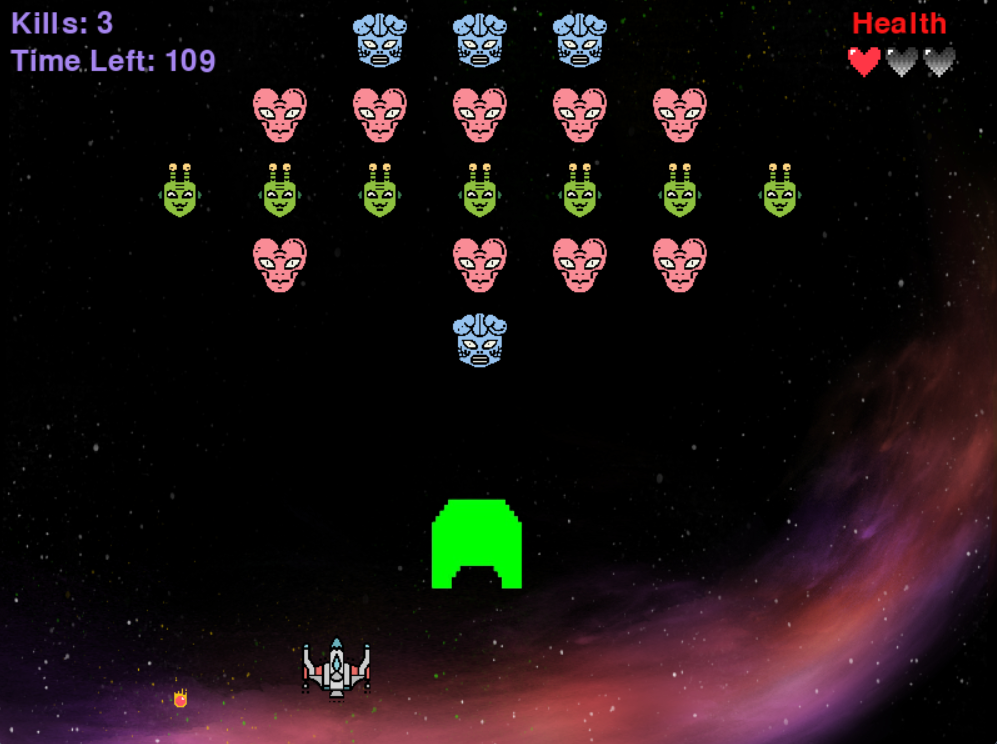
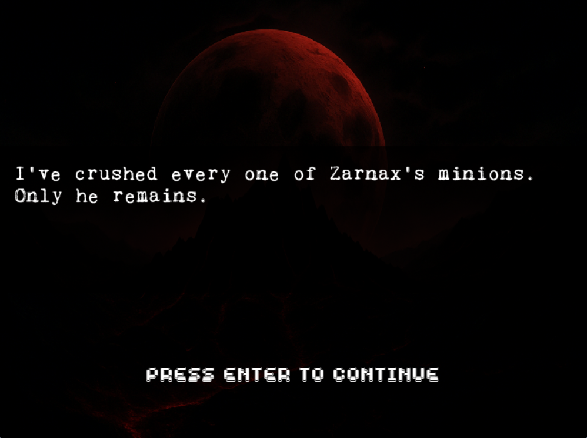
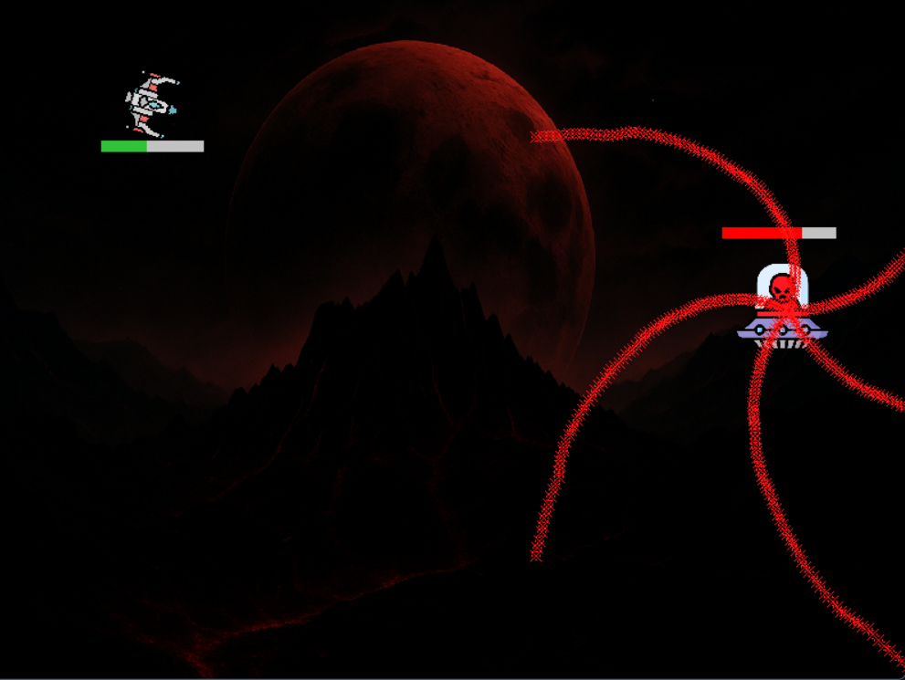
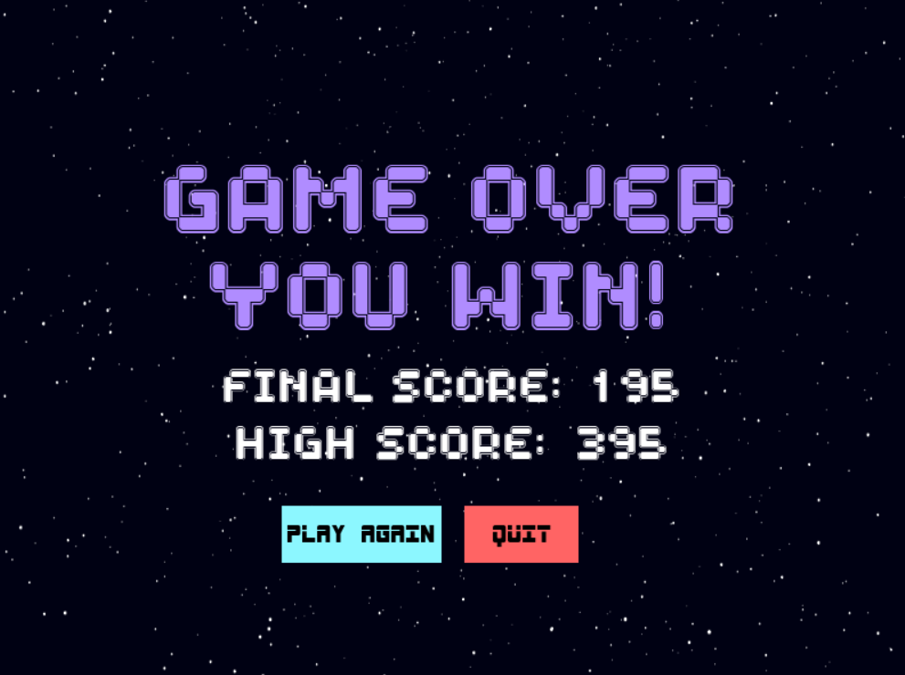

# 🚀 Space Invader: Final Descent – Pygame Edition

A retro-futuristic **Space Invader** game built using **Python + Pygame**, featuring an intense **boss fight** finale. Strap in for a pixel-perfect battle with **Zarnax**, complete with cinematic intro, dynamic boss phases, and immersive sound design.

---

## 🧩 Features

- 🎯 **Boss Mechanics** – Multi-phase fight with vulnerable/burst states  
- 🎞️ **Narrative Intro** – Typewriter-style text crawl before the final descent  
- 💥 **Bullet Collision System** – Real-time projectile detection  
- 🩸 **Health Bars** – For both player and boss  
- 🔊 **Sound & Music** – Laser blasts, explosions, and eerie background soundtrack  
- ⏸️ **Pause/Mute Support** – `P` to pause, `M` to mute/unmute music, `S` to toggle SFX  
- 💀 **Player Damage & Invincibility Frames**  
- 🕹️ **Responsive Controls** – Smooth and precise movement  

---

## 🎮 Controls

| Key         | Action              |
|-------------|---------------------|
| Arrow Keys  | Move the spaceship  |
| Spacebar    | Fire bullet         |
| P           | Pause/Unpause       |
| M           | Mute/Unmute music   |
| S           | Toggle sound effects|
| Esc         | Quit the game       |

---

## 🖼️ Preview







---

## 🛠️ Requirements

- Python 3.x
- `pygame` module

- Install using:
`pip install pygame`

---
## ▶️ How to Run

### 🔹 Step 1: Install Requirements  
Make sure Python is installed. Then install the Pygame module.

```bash
  pip install pygame
```
### 🔹 Step 2: Place All Required Files in the Same Folder
Ensure that all requirements following files are in the same directory.
## 🔹 Step 3: Run the Game

Open a terminal or command prompt, navigate to the folder where your game files are located, and run:

```bash
  python menu.py
```
---

## 💡 Features
**🎯 Bullet Collision** – Destroy enemies before they reach you.

**🧠 Boss Enemy** – Fight a UFO with higher health.

**💓 Health Bar** – Visual life tracking system.

**🔊 Sound Effects** – Laser fire, explosions, and background music.

**🎮 Game Over Menu** – Replay or quit with the click of a button.

**💾 Score System** – Track your performance each round.

---

## 👨‍💻 Author

Made with ❤️ by [Aditya Singh](https://github.com/adityas-28)
=======
